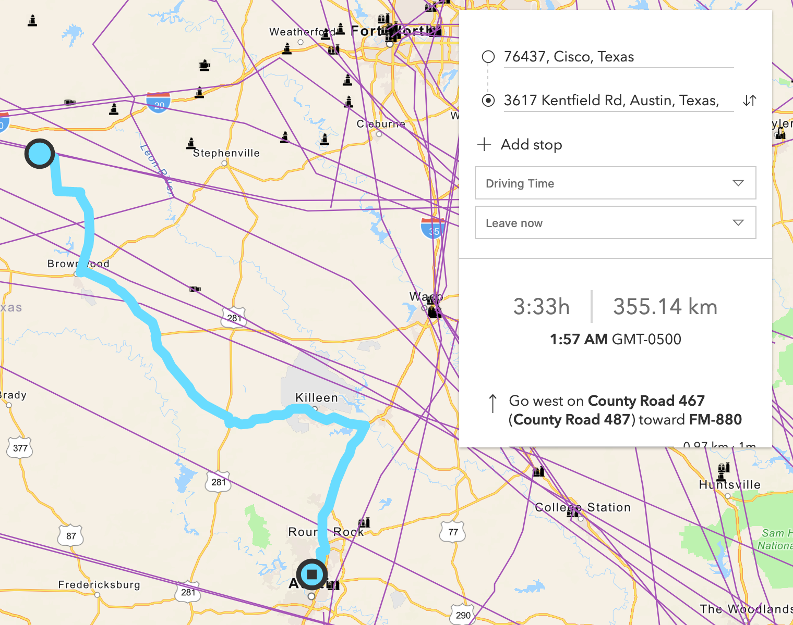
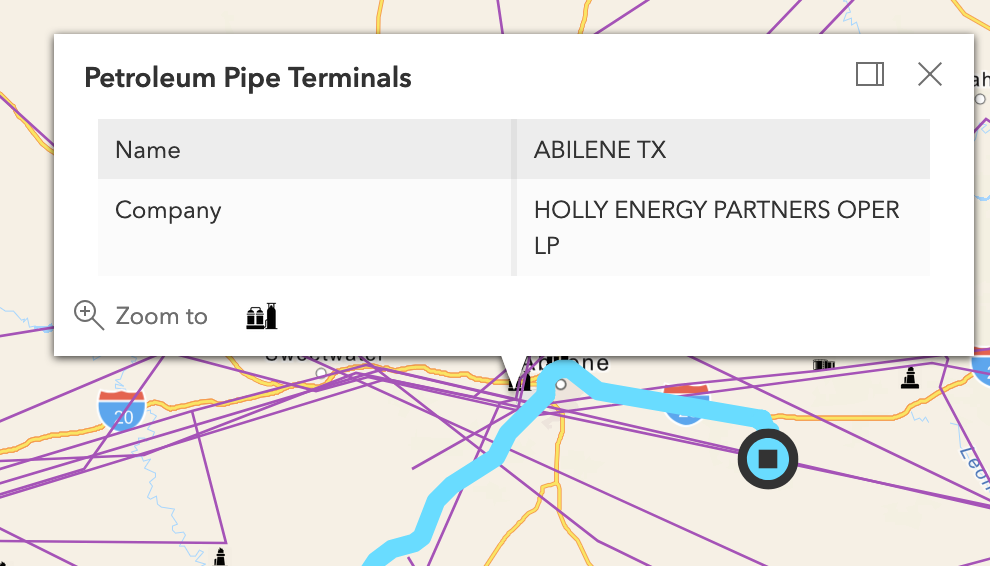

# Digital Oil Field project

This was my capstone for my GIS CD degree, and I am very proud of it. It is an asset management webmap coded in mainly javascript, with html and css styling, that will automatically route the oil or natural gas from well to refinery to pipeline or storage... anywhere you want! Despite not being able to get the entire range of data needed, all functionality and usability was completed as intended from the beginning of the project. In the future, this app could be built upon to create a similar interface with even more specialized functionality in an industry setting.

The code can be found in the code folder along with some icons and images utilized in the code. the images folder holds the images presented below of the application in use, as well as some others, and the research folder contains papers, presentations, and possibly some drafts used for the creation, presentation and justification for this project.

### Asset Management Webmap:

Here you can see each asset class has its own icon, the routing interface hangs from the top right of the screen. The routing mechanism can be triggered by typing or clicking, which is a great addition for those who do not know the name of the well or refinery they are mapping to, for example if they just wanted the closest one.

### Here is a closeup of the routing feature in action:

Here the ESRI routing API used really shines. It displays the time, distance, locations, Estimated Time of Arrival and step by step directions along the way. It is an excellent resource for any routing based application and very friendly to configuring and customization with small code tweaks.

### Here is a closeup of a popup on a Pipe Terminal:

These interactive popups help display information about each asset on the webmap, helping operators easily locate the location they need and quickly get there. Each type of asset has its own icon and class title, making them easily distinguishable to the human eye (These can even be further differentiated by color and size, but in the interest of reducing ckutter, the small black icon was chosen). The great thing about these popus is the amount of information can be changed to include address, operator, company, amounts pumped, etc. Almost any piece of information can be displayed about these assets due to the size/specificity of databases used and the amount of data collection occuring in the oil field today.
