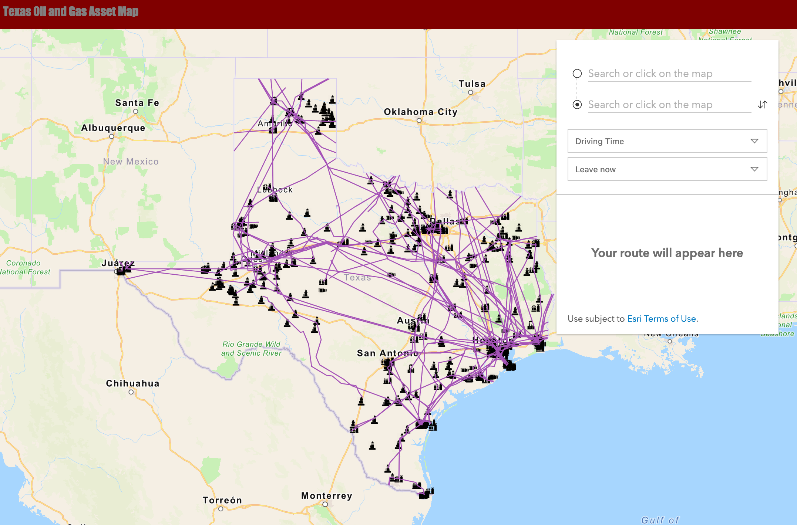

# Digital Oil Field project

This was my capstone for my GIS CD degree, and I am very proud of it. Despite not being able to get the entire range of data needed, all functionality and usability was completed as intended from the beginning of the project. In the future, this project could be built upon to create a similar interface with even more specialized functionality in an industry setting

A repo for submitting lab 4 to 392
### This is the output of the code:

### This is the output of the csv intersection:

